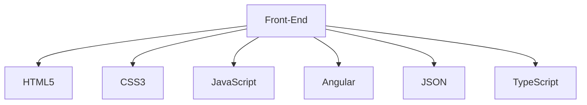
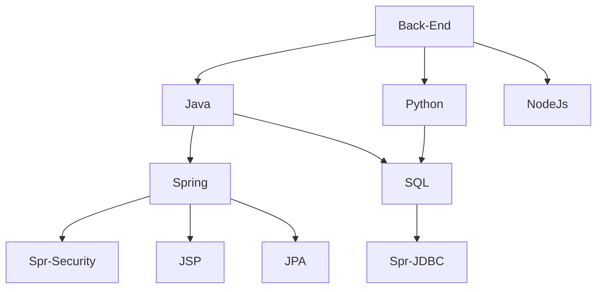

# 

<!------------------------------------------------------------------------------------------------------------------------------------------->
Soy Lic en Bioimagenes, egresado de la UBA, con una Especialización en Hemodinamia. Y Programador universitario egresado de la UTN San Rafael actualmente terminando una certificacion en Salesforce y tratando de combinar ambos mundos, 

<!------------------------------------------------------------------------------------------------------------------------------------------->

<!------------------------------------------------------------------------------------------------------------------------------------------->

  
   
  
  

 

<!------------------------------------------------------------------------------------------------------------------------------------------->

  

      
    
    

<!-------------------------------------------------------------------------------------------------------------------------------------------->

<!----------------------------------------------------------------------------------------------------------------------------------------------->

<!----------------------------------------------------------------------------------------------------------------------------------------------->

 
<b>Visitors Count 👽 </b>
  

 
 

<!----------------------------------------------------------------------------------------------------------------------------------------------->

